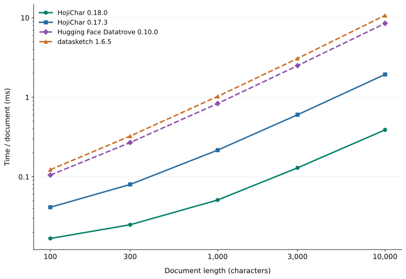

# MinHash / LSH generation benchmark

HojiChar 0.18.0 generates keys **4.61x faster than HojiChar 0.17.3** and **18.93x faster than Hugging Face Datatrove 0.10.0** on this 2,000-character English workload. These are measured hash-generation rates, not end-to-end preprocessing speeds or comparisons of deduplication accuracy.

| Implementation | ms/document | documents/second | Speed vs Datatrove |
| --- | ---: | ---: | ---: |
| HojiChar 0.18.0 | 0.0871 | 11,480.7 | 18.93x |
| HojiChar 0.17.3 | 0.4012 | 2,492.3 | 4.11x |
| Hugging Face Datatrove 0.10.0 | 1.6485 | 606.6 | 1.00x |
| datasketch 1.6.5 | 2.0274 | 493.2 | 0.81x |

## Workload and measurement

- macOS ARM64, CPython 3.11.15, NumPy 2.0.2; complete environment in `requirements.txt` and `environment.json`.
- Three fixed English excerpts of 2,000 Unicode characters from [Alice's Adventures in Wonderland](https://www.gutenberg.org/ebooks/11), saved in `inputs.json`. Whitespace was collapsed before sampling. These are literary excerpts, not Common Crawl samples.
- Character 5-grams, 500 signature components, 25 bands of 20 components, 32-bit component hashes; seed 42 where supported. Equal component counts do not imply equal statistical accuracy or compatible hashes.
- Timed work: text to band-key strings, including n-grams, token hashes, MinHash and band encoding. Initialization, LSH parameter search, I/O, indexing, lookup and duplicate decisions are excluded.
- Five rounds in shuffled order, with sequential measurements in persistent isolated processes. Blocks are calibrated to at least 80 ms; results are medians of the five per-document batch averages. Numeric-library thread counts are one; garbage collection is disabled during timing.

A 2,000-character document approximates a typical extracted web-text document: [WIMBD, Table 15](https://arxiv.org/pdf/2310.20707#page=33) reports character-length medians of 1,153 for C4, 1,988 for mC4-en, 2,163 for OSCAR and 3,185 for OpenWebText. This is a representative length, not the mean of raw Common Crawl or an estimate of total corpus processing time.

## Compared implementations

- **HojiChar 0.18.0:** implementation at commit `e60b0b802fb5a3bf186de23d802f4c547a5376d0`, using Rensa 0.5.0, direct character slices and optimized band encoding.
- **HojiChar 0.17.3:** implementation at commit `897f38f03434097bfc929fdb52dbc5e39eed9f94`, using Rensa 0.2.7. Band geometry is set outside timing to match 25 x 20. This comparison includes both the Rensa upgrade and HojiChar's Python optimizations.
- **Datatrove 0.10.0:** original `get_shingles` and `get_signature`, with a character tokenizer, normalization disabled and 32-bit xxhash. Its default word tokenizer and 64-bit configuration are not used. Signature generation uses NumPy directly, not datasketch. Original space-separated n-grams are retained.
- **datasketch 1.6.5:** a comparison adapter using `MinHash.update_batch`, cached permutation coefficients and xxhash32. This is not a historical HojiChar implementation.

The two comparison adapters encode their bands as xxhash128 hexadecimal keys. Current HojiChar directly slices character n-grams; old HojiChar and Datatrove retain space-separated character n-grams. These differences are included in the measured work.

## Files and reproduction

`throughput_data.json` and `samples.json` contain the 2,000-character measurements. `latency_data.json` contains the earlier English measurements across 100–10,000 characters. `source_metadata.json` identifies and checksums the exact HojiChar source revisions. PNG and SVG charts are generated by `plot.py`.

Recreate the measurement environment separately from the project's environment, using Python 3.11. The repository must contain both recorded Git revisions. Run from the repository root:

```sh
uv venv --python 3.11 /tmp/hojichar-minhash-bench
uv pip install --python /tmp/hojichar-minhash-bench/bin/python -r benchmarks/minhash/requirements.txt
uv pip install --python /tmp/hojichar-minhash-bench/bin/python --target /tmp/hojichar-minhash-rensa05 --no-deps rensa==0.5.0
/tmp/hojichar-minhash-bench/bin/python benchmarks/minhash/benchmark.py --repo "$PWD" --rensa05 /tmp/hojichar-minhash-rensa05
/tmp/hojichar-minhash-bench/bin/python benchmarks/minhash/plot.py
```

The benchmark updates the 2,000-character results and samples; the previously measured length curve is retained. To redraw only the charts, install Matplotlib and run `plot.py`. Absolute and relative speeds depend on hardware, input distribution and configuration.


